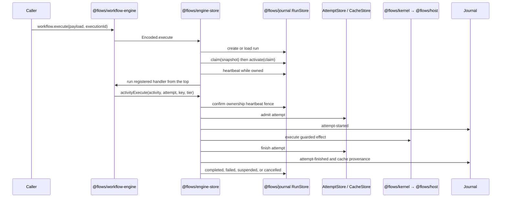

# Execution and data flow

This page traces one workflow execution through the current implementation, from a typed workflow call to ownership, activity persistence, suspension, and replay. It focuses on cross-package data flow rather than individual API signatures.

## 1. Definition and registration

`Workflow.make` creates a typed value containing payload, success, and error schemas. `workflow.toLayer(handler)` registers a handler in the active `WorkflowEngine` scope. Registration is in memory even when execution state is durable, so every process that may drive a run must register the same workflow definitions before resuming them.

## 2. Execution identity

The caller supplies `executionId`, or the workflow derives one from its opt-in `idempotencyKey`. The durable driver persists the encoded payload under that execution ID. A second request with the same ID must have the same workflow tag and encoded payload.

## 3. Claim and heartbeat

The driver reads an exact `RunSnapshot`, performs a claim compare-and-swap, activates that claim, and then changes the row to `running`. A heartbeat fiber updates the row every second. Losing the ownership fence interrupts the driving fiber, preventing two processes from persisting terminal state for one run.

## 4. Re-execution and activities

Resume invokes the handler from the top. Durable behavior exists at `Activity`, `DurableDeferred`, and clock boundaries:

- A previously successful attempt returns its stored outcome.
- An eligible sealed activity may restore declared outputs from the shared cache.
- An unfinished deferred suspends the workflow.
- The first activity or deferred without recorded state is the live frontier.

Workflow-local JavaScript or Effect code between those boundaries runs again. It must therefore be deterministic.

## 5. Activity persistence

The workflow runtime computes a `StepKey` before calling the encoded engine:

- sealed activity plus declared content identity → content key;
- otherwise → run-local ordinal key.

The engine store hashes that key again for its database address, confirms the run fence, admits an attempt, executes it, and persists the first terminal transition. Only a sealed activity with a hard `StepBoundary` descriptor and deviation-free evidence is admitted to the global cache.

## 6. Suspension and wake-up

`DurableDeferred.await` and long `DurableClock.sleep` calls return `Workflow.Suspended` when no result exists. The driver transitions the run to `suspended`, clearing owner and heartbeat. Deferred completion is ordered:

1. store the completion;
2. emit and flush its journal record;
3. schedule a claim-gated wake.

The workflow engine still uses polling as a fallback because `EngineStore` does not implement `resumeSignal`.

## 7. Terminal state

A completed handler stores its schema-encoded `Workflow.Result` in the run row and moves to `completed` or `failed`. Interruption moves an owned run to `cancelled`. Every terminal transition clears ownership.

## 8. Read paths

The durable data has three independent readers:

- `Journal.entries`, `stream`, and `project` replay committed evidence.
- `@flows/sync` catches up and follows journal entries remotely.
- `@flows/time-travel` reads frames and suffixes, consults cache entries, and coordinates archive/truncation through `TimeTravelStore`.

These readers do not drive workflow handlers unless an explicit resume operation enters the claim path.
