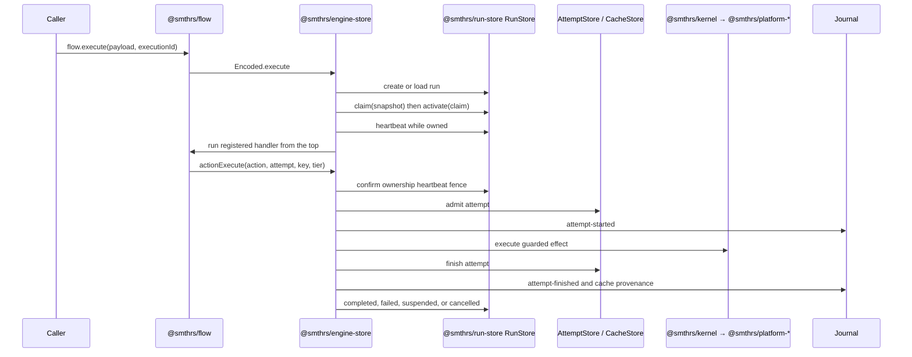

# Execution and data flow

This page traces one flow execution through the current implementation, from a typed flow call to ownership, action persistence, suspension, and replay. It focuses on cross-package data flow rather than individual API signatures.

## 1. Definition and registration

`Flow.make` creates a typed value containing payload, success, and error schemas. `flow.toLayer(handler)` registers a handler in the active `FlowEngine` scope. Registration is in memory even when execution state is durable, so every process that may drive a run must register the same flow definitions before resuming them.

## 2. Execution identity

The caller supplies `executionId`, or the flow derives one from its opt-in `idempotencyKey`. The durable driver persists the encoded payload under that execution ID. A second request with the same ID must have the same flow tag and encoded payload.

## 3. Claim and heartbeat

The driver reads an exact `RunSnapshot`, performs a claim compare-and-swap, activates that claim, and then changes the row to `running`. A heartbeat fiber updates the row every second. Losing the ownership fence interrupts the driving fiber, preventing two processes from persisting terminal state for one run.

## 4. Re-execution and actions

Resume invokes the handler from the top. Durable behavior exists at `Action`, `DurableDeferred`, and clock boundaries:

- A previously successful attempt returns its stored outcome.
- An eligible sealed action may restore declared outputs from the shared cache.
- An unfinished deferred suspends the flow.
- The first action or deferred without recorded state is the live frontier.

Flow-local JavaScript or Effect code between those boundaries runs again. It must therefore be deterministic.

## 5. Action persistence

The flow runtime computes a `Key` before calling the encoded engine:

- sealed action plus declared cache key input → cache key;
- otherwise → run-local invocation key.

The engine store hashes that key again for its database address, confirms the run fence, admits an attempt, executes it, and persists the first terminal transition. Only a sealed action with a hard `StepBoundary` descriptor and deviation-free evidence is admitted to the global cache.

## 6. Suspension and wake-up

`DurableDeferred.await` and long `DurableClock.sleep` calls return `Flow.Suspended` when no result exists. The driver transitions the run to `suspended`, clearing owner and heartbeat. Deferred completion is ordered:

1. store the completion;
2. emit its journal record on the durable channel (which commits it), then flush the lossy queue best-effort — a latched lossy-sink failure is logged, never fatal to delivery;
3. schedule a claim-gated wake.

`EngineStore` implements `resumeSignal` over the in-process `WakeBus`, so a wake published in this process resumes the waiting engine without a poll tick; the poll loop remains the bounded fallback for wakes published elsewhere.

## 7. Terminal state

A completed handler stores its schema-encoded `Flow.Result` in the run row and moves to `completed` or `failed`. Interruption moves an owned run to `cancelled`. Every terminal transition clears ownership.

## 8. Read paths

The durable data has three independent readers:

- `Journal.entries`, `stream`, and `project` replay committed evidence.
- `@smthrs/sync` catches up and follows journal entries remotely.
- `@smthrs/time-travel` reads frames and suffixes, consults cache entries, and coordinates archive/truncation through `TimeTravelStore`.

These readers do not drive flow handlers unless an explicit resume operation enters the claim path.
