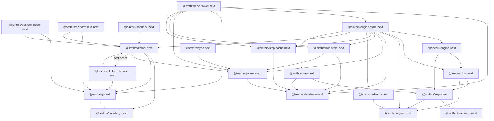

# Package map

This page defines the repository’s package boundaries and actual workspace dependency direction. It is an architecture map, not an API reference; follow each package link for its exported types and functions.

An arrow means “depends on.” The one dotted edge is a test-only seam: `@smthrs/kernel-next`’s `test/TestHost` composes `@smthrs/platform-browser-next`’s in-tab `FileSystem` and `ChildProcessSpawner` to build its deterministic host, so the manifest edge exists in that direction too. No production module in `@smthrs/kernel-next` imports a platform bundle.

| Package | Responsibility | Important boundary |
| --- | --- | --- |
| [`@smthrs/canonical-next`](../reference/canonical.md) | RFC 8785 canonical JSON as an Effect Schema | Wraps the standards-focused `canonicalize` library |
| [`@smthrs/crypto-next`](../reference/crypto.md) | Injected cryptographic schema transformations | Platform implementation is supplied through Effect Crypto |
| [`@smthrs/keys-next`](../reference/keys.md) | Canonical flow keys | Composes `canonical` and `crypto` |
| [`@smthrs/database-next`](../reference/database.md) | `SqlClient` access plus transactional SQLite write retry | Owns no domain tables |
| `@smthrs/platform-node-next`, `@smthrs/platform-bun-next` | The Node and Bun Host bundles: Effect's own platform services — filesystem, path, spawner, `HttpClient` — composed with the `Jj` adapter | Raw effects; no permission decisions. Bun composes `@effect/platform-bun` directly and does not depend on `@smthrs/platform-browser-next` |
| [`@smthrs/capability-next`](../reference/capability.md) | The capability vocabulary — actions, patterns, tiers — and typed permission failures with their `PlatformError` projection | A leaf both the kernel and `@smthrs/jj-next` depend on; its schema ids stay `@smthrs/kernel-next/…` because they are journaled |
| [`@smthrs/jj-next`](../reference/jj.md) | Jujutsu snapshot, restore, diff, and workspace operations | Depends on `effect` and `@smthrs/capability-next`; the closed Host list still names it |
| [`@smthrs/sandbox-next`](../reference/sandbox.md) | A remote `ChildProcessSpawner` implementation and sandbox liveness | Adapts a caller's provider onto Effect's `ChildProcessSpawner`; owns no host access |
| [`@smthrs/platform-browser-next`](../reference/platform-browser.md) | Browser implementations of effect's `FileSystem` and `ChildProcessSpawner`, and the `BrowserHost` bundle, which provides effect's own fetch-backed `HttpClient` | Depends on `effect`, `@smthrs/kernel-next`, and `@smthrs/jj-next` for the slots it fills; the ZenFS and just-bash backends are arguments, not dependencies |
| [`@smthrs/journal-next`](../reference/journal.md) | The immutable event history: journal rows, projections, redaction, and the `OwnerId` fence its durable channel accepts | Open event envelope; owns `flows_journal_events` only |
| [`@smthrs/run-store-next`](../reference/run-store.md) | Executable run state: run rows, attempt rows, and ownership arbitration | Owns `flows_runs` and `flows_attempts`; validates supplied liveness evidence, never probes |
| [`@smthrs/step-cache-next`](../reference/step-cache.md) | Sealed step results addressed by step-key digest, plus the HTTP action-cache client and the local-first/remote-second composition | Owns `flows_step_cache`; depends on `database` alone |
| [`@smthrs/plan-next`](../reference/plan.md) | The persisted plan: the `KeyMaterial`→`StepKey` compiler, `Plan.compile`/`append`, `PlanDiff`, and the append-only `PlanStore` | Owns `flows_plans`, `flows_plan_nodes`, `flows_plan_edges`, and migration block `4000`; performs no I/O beyond the database and executes nothing |
| [`@smthrs/artifacts-next`](../reference/artifacts.md) | The content-addressed artifact store the step cache references by digest: local, remote-over-HTTP, and the combination | Owns no tables and no migration; depends on `crypto` alone. Host access is Effect's `FileSystem` and `HttpClient` tags |
| [`@smthrs/flow-next`](../reference/flow.md) | The flow authoring model — flows, activities, durable primitives, retry policy, step identity — and the `FlowRuntime` port they execute against | Declares the runtime port; depends on nothing that implements it |
| [`@smthrs/engine-next`](../reference/engine.md) | The runtime that executes flows: the encoded engine seam, its typed adapter, the in-memory implementation, and the RPC/HTTP façades | Computes activity keys above the encoded engine seam |
| [`@smthrs/kernel-next`](../reference/kernel.md) | Capability sets, grants, and guarded Host decorators | Permission checks occur immediately before Host delegation |
| [`@smthrs/engine-store-next`](../reference/engine-store.md) | Durable `FlowEngine` implementation composing the journal, run, and cache stores | Claims runs before driving and fences activity persistence; owns the deferred/clock tables and composes every migration set |
| [`@smthrs/sync-next`](../reference/sync.md) | Read-only journal replication protocol and RPC client/server | It does not mutate runs or journal state |
| [`@smthrs/time-travel-next`](../reference/time-travel.md) | Replay, fork, rewind, compensation, recovery, and retry utilities | Operates through public journal, run-store, step-cache, `Jj`, and time-travel store contracts |
| [`@smthrs/flows-next`](../reference/flows.md) | The umbrella barrel: every engine package re-exported as a namespace, plus `@smthrs/flow-next` flat and `TimeTravel` as a service key | Owns no code of its own beyond `namespaces`; the three `platform-*` bundles are deliberately not re-exported |

## Two persistence seams

Each storage package owns its own tables and its own migration set:
`@smthrs/journal-next` owns `flows_journal_events`, `@smthrs/run-store-next` owns
`flows_runs` and `flows_attempts`, `@smthrs/step-cache-next` owns
`flows_step_cache`, `@smthrs/plan-next` owns `flows_plans`, `flows_plan_nodes`, and
`flows_plan_edges`, and `@smthrs/engine-store-next` owns
`flows_deferred_completions` and `flows_clock_deadlines`. `@smthrs/database-next`'s `Migrations` composes those
sets over one `flows_migrations` table, namespacing each package's migration
ids into a reserved block so two packages' `0001_initial` cannot collide.
`@smthrs/engine-store-next` adds `DurableEngineState`: `layer` persists those waits
through `DurableWriter`, while `layerMemory` remains available for deterministic
tests.

`@smthrs/time-travel-next` adds audit, receipt, snapshot, lineage-edge, and archive tables through `SqlTimeTravelStore`. Those tables are separate from the journal migration.

## Runtime-specific edges

The core contracts are isomorphic, but not every aggregate is runtime-neutral:

- `@smthrs/engine-store-next` mints owner identity through the injectable `OwnerIdentity` service rather than reading `process.pid` and `node:crypto` directly, so the package root — and the `@smthrs/flows-next` barrel above it — bundles for the browser. Running it still needs a browser SQL client for the `DurableWriter` contract, and none ships here.
- Vendor host adapters (`@smthrs/host-cloudflare`, `@smthrs/host-vercel`) live in the [plugins repository](https://github.com/smithersai/plugins).

See [implementation status](implementation-status.md) and the Cloudflare and Vercel guides in the [plugins repository](https://github.com/smithersai/plugins/blob/main/docs/guides/).
