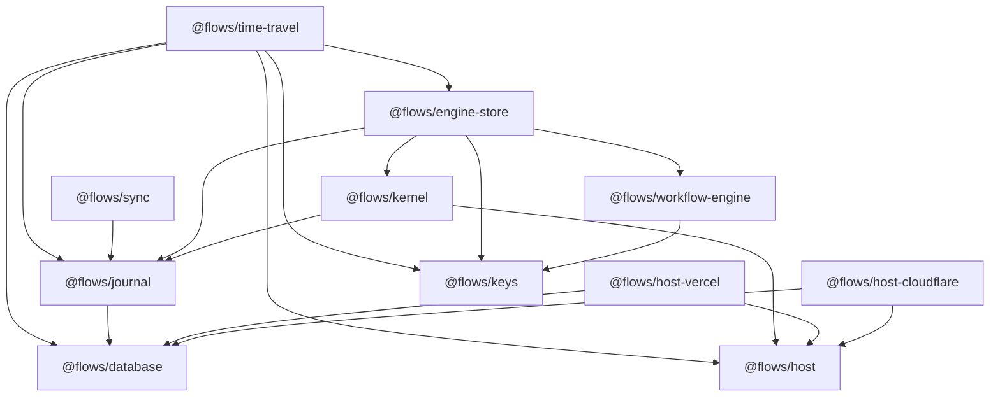

# Package map

This page defines the repository’s package boundaries and actual workspace dependency direction. It is an architecture map, not an API reference; follow each package link for its exported types and functions.

An arrow means “depends on.”

| Package | Responsibility | Important boundary |
| --- | --- | --- |
| [`@flows/keys`](../reference/keys.md) | Pure canonical serialization and step-key construction | No Effect services and no other workspace dependency |
| [`@flows/database`](../reference/database.md) | `SqlClient` access plus transactional SQLite write retry | Owns no domain tables |
| [`@flows/host`](../reference/host.md) | Closed machine-facing service contracts and Node, Bun, browser, and test implementations | Raw effects; no permission decisions |
| [`@flows/journal`](../reference/journal.md) | Journal, run ownership, attempts, and cache rows | Open event envelope; SQL-backed state |
| [`@flows/workflow-engine`](../reference/workflow-engine.md) | Vendored Effect workflow runtime with flows identity and retry semantics | Computes activity keys above the encoded engine seam |
| [`@flows/kernel`](../reference/kernel.md) | Capability sets, grants, and guarded Host decorators | Permission checks occur immediately before Host delegation |
| [`@flows/engine-store`](../reference/engine-store.md) | Durable `WorkflowEngine` implementation over journal stores | Claims runs before driving and fences activity persistence |
| [`@flows/sync`](../reference/sync.md) | Read-only journal replication protocol and RPC client/server | It does not mutate runs or journal state |
| [`@flows/time-travel`](../reference/time-travel.md) | Replay, fork, rewind, compensation, recovery, and retry utilities | Operates through public journal, cache, Host, and time-travel store contracts |
| [`@flows/host-cloudflare`](../reference/host-cloudflare.md) | Workers Host and Durable Object database adapters | Not a complete Worker engine deployment |
| [`@flows/host-vercel`](../reference/host-vercel.md) | Edge and Node Host adapters plus server database binding | Edge root excludes server-only database code |

## Two persistence seams

`@flows/journal` owns event rows, run rows, attempt rows, cache rows, and the
migrations for deferred completions and clock deadlines.
`@flows/engine-store` adds `DurableEngineState`: `layer` persists those waits
through `Database`, while `layerMemory` remains available for deterministic
tests.

`@flows/time-travel` adds audit, receipt, snapshot, lineage-edge, and archive tables through `SqlTimeTravelStore`. Those tables are separate from the journal migration.

## Runtime-specific edges

The core contracts are isomorphic, but not every aggregate is runtime-neutral:

- `@flows/engine-store` currently reads `process.pid` and `node:crypto`.
- `@flows/host-cloudflare` supplies a Worker-safe Host and Durable Object database layer, but not a Worker-safe engine-store implementation.
- `@flows/host-vercel` keeps its root edge-safe and exposes Node and database adapters from `@flows/host-vercel/node` and `@flows/host-vercel/store`.

See [implementation status](implementation-status.md) and the [Cloudflare](../guides/cloudflare.md) and [Vercel](../guides/vercel.md) guides.
