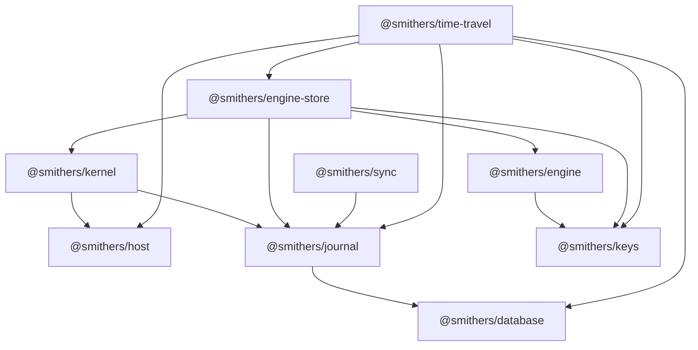

# Package map

This page defines the repository’s package boundaries and actual workspace dependency direction. It is an architecture map, not an API reference; follow each package link for its exported types and functions.

An arrow means “depends on.”

| Package | Responsibility | Important boundary |
| --- | --- | --- |
| [`@smithers/keys`](../reference/keys.md) | Pure canonical serialization and step-key construction | No Effect services and no other workspace dependency |
| [`@smithers/database`](../reference/database.md) | `SqlClient` access plus transactional SQLite write retry | Owns no domain tables |
| [`@smithers/host`](../reference/host.md) | Closed machine-facing service contracts and Node, Bun, browser, and test implementations | Raw effects; no permission decisions |
| [`@smithers/journal`](../reference/journal.md) | Journal, run ownership, attempts, and cache rows | Open event envelope; SQL-backed state |
| [`@smithers/engine`](../reference/engine.md) | Vendored Effect flow runtime with flows identity and retry semantics | Computes activity keys above the encoded engine seam |
| [`@smithers/kernel`](../reference/kernel.md) | Capability sets, grants, and guarded Host decorators | Permission checks occur immediately before Host delegation |
| [`@smithers/engine-store`](../reference/engine-store.md) | Durable `FlowEngine` implementation over journal stores | Claims runs before driving and fences activity persistence |
| [`@smithers/sync`](../reference/sync.md) | Read-only journal replication protocol and RPC client/server | It does not mutate runs or journal state |
| [`@smithers/time-travel`](../reference/time-travel.md) | Replay, fork, rewind, compensation, recovery, and retry utilities | Operates through public journal, cache, Host, and time-travel store contracts |

## Two persistence seams

`@smithers/journal` owns event rows, run rows, attempt rows, cache rows, and the
migrations for deferred completions and clock deadlines.
`@smithers/engine-store` adds `DurableEngineState`: `layer` persists those waits
through `Database`, while `layerMemory` remains available for deterministic
tests.

`@smithers/time-travel` adds audit, receipt, snapshot, lineage-edge, and archive tables through `SqlTimeTravelStore`. Those tables are separate from the journal migration.

## Runtime-specific edges

The core contracts are isomorphic, but not every aggregate is runtime-neutral:

- `@smithers/engine-store` currently reads `process.pid` and `node:crypto`.
- Platform host adapters (`@smithers/host-cloudflare`, `@smithers/host-vercel`) live in the [plugins repository](https://github.com/smithersai/plugins).

See [implementation status](implementation-status.md) and the Cloudflare and Vercel guides in the [plugins repository](https://github.com/smithersai/plugins/blob/main/docs/guides/).
