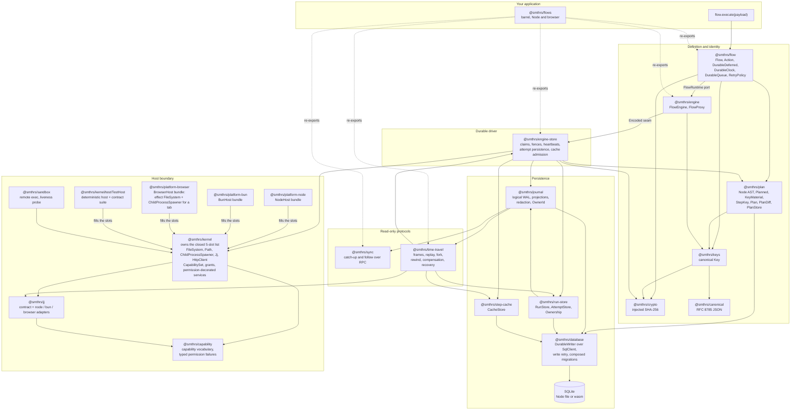
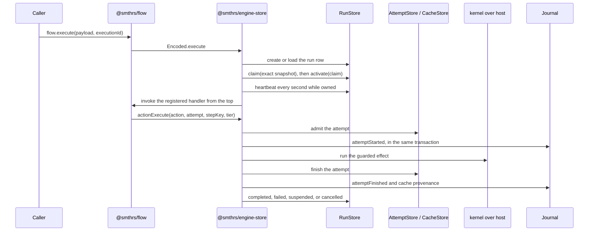

# Architecture

Smithers Flows is one durable-execution engine assembled from the workspace packages listed in [package structure](/package-structure). This page shows how they fit together, which direction data moves, and where the boundaries you can substitute are. Read it before anything else; the pages after it assume the picture below.

## The whole system

:::note[Reading the diagram]
Solid arrows are workspace dependencies that execute. Dotted arrows are re-exports.
:::

## What each boundary is for

Ask what would break if a boundary were removed, and its purpose becomes clear.

The **host boundary** exists so flow code can run in a browser. `@smthrs/kernel` declares a closed set of five service tags and nothing else; every platform implementation lives in its own package: `@smthrs/platform-node`, `@smthrs/platform-bun`, `@smthrs/platform-browser`. Four of those five tags are Effect's own: `FileSystem`, `Path`, `ChildProcessSpawner`, and `HttpClient` are contracts `effect` already declares, so `flows` supplies implementations rather than wrappers. One more, `Jj`, is a contract of `@smthrs/jj`, whose tag the kernel decorates in place rather than shadowing with a second one, so a consumer that needs only that capability does not take the whole host surface. A module that depends only on the kernel root never statically resolves a `node:` built-in, which is what makes browser bundling possible at all. `@smthrs/kernel` sits in front of that surface and decorates each service with a grant check, so a flow that asks for a file it was never granted fails in the error channel rather than reading the file.

The **database and journal** split separates the storage driver from the shapes stored in it. `@smthrs/database` owns no domain tables; it wraps any Effect `SqlClient` and adds the transactional write retry that the rest of the system assumes. `@smthrs/journal`, `@smthrs/run-store`, `@smthrs/step-cache`, `@smthrs/plan`, and `@smthrs/engine-store` each own their own tables and the migration set that creates them, composed over one migrations table. Swap the driver and every shape survives.

The **canonical, crypto, keys, and engine** chain decides identity before storage sees anything. `@smthrs/canonical` owns RFC 8785 JSON, `@smthrs/crypto` owns injected hashing, `@smthrs/keys` owns the canonical flow-key transformation, and `@smthrs/engine` owns action-key policy above the seam. The engine computes a key before it calls `FlowEngine.Encoded.actionExecute`, so storage never implements key policy.

The **plan** boundary separates describing work from doing it. `@smthrs/plan` holds the authoring AST a flow body builds, the key material a planner declares, the step-key compiler, the compiled graph, its diff, and its append-only store. Planning performs no I/O, so nothing in it reads a file, a clock, or a network: declared effects carry read and write paths, never digests. A node's key is a function of what it consumes, which is the whole invalidation mechanism. An edited declaration re-keys that node and its dependent cone and nothing else, so there is no reverse-dependency index. Driving a compiled plan is `@smthrs/engine-store`'s `PlanScheduler`.

The **flow, engine, and engine-store** chain separates what a durable program is from what runs it and from where it is written. `@smthrs/flow` defines flows, actions, durable deferreds, durable clocks, durable queues, and retry policy as typed values, written against the `FlowRuntime` port it declares. `@smthrs/engine` implements that port and puts an encoded seam beneath it. `@smthrs/engine-store` implements that seam over the journal: it claims a run row before driving it, fences continuing work with a heartbeat, admits and finishes attempt rows, and commits each lifecycle entry in the same transaction as the state transition it describes.

**Extension** has no package of its own, because it is Effect dependency injection. Every behavior a program may reasonably want to replace is either a named service (`Inconsistency` for cache-conflict verdicts, `OwnerIdentity` for owner minting, `StepBoundary` for hermeticity, `Jj` and the rest of the closed host list for host access, `Clock` and `Random` for time and nondeterminism) or a constructor option carrying the built-in behavior as its default, such as `suspendedRetryPolicy` and `clockFireRetryPolicy`. Providing a different `Layer` at the composition root is the whole mechanism; there is no hook registry and no dispatch order to reason about. See [design decisions](/design-decisions).

The **read-only protocols** consume the journal without acquiring ownership. `@smthrs/sync` streams committed entries to a follower over Effect RPC and can neither mutate a run nor resume one. `@smthrs/time-travel` reads frames out of the same history and adds its own tables for snapshots, lineage edges, audits, receipts, and archived entries.

The **barrel**, `@smthrs/flows`, re-exports the engine packages as namespaces for a single-import application. A browser application may still prefer the per-package roots for a narrower dependency footprint.

## One execution, end to end

Six things happen in that sequence, and each one is a decision you can inspect.

**Definition and registration.** `Flow.make` produces a typed value carrying payload, success, and error schemas, a stable tag, and the required pure `body` that is the flow's behavior. `Interpreter.layer(flow)` registers it in the active `FlowEngine` scope and drives that body; an action attaches its own implementation with `Action.toLayer`.

:::warning
Registration is in memory even when the state is durable. A restarted process must re-register its flows before it can drive stored runs.
:::

**Execution identity.** The caller supplies `executionId`, or the flow derives one from an opt-in `idempotencyKey`. The driver persists the encoded payload under that identity, and a second request with the same identity must present the same flow tag and the same encoded payload.

**Claim and heartbeat.** The driver reads an exact `RunSnapshot`, performs a compare-and-swap claim against it, activates the claim, and only then moves the row to `running`. A heartbeat fiber refreshes the fence every second. Losing the fence interrupts the driving fiber, so two processes cannot persist terminal state for one run.

**Replay and the frontier.** A resume invokes the handler from the top. At each recorded boundary the driver returns the stored result. The first boundary with no recorded state is the frontier, and that is where new work happens.

:::warning
Code between boundaries runs again on every replay, so it has to be deterministic.
:::

**Suspension.** `DurableDeferred.await` and long `DurableClock.sleep` calls return `Flow.Suspended` when no result exists. The driver parks the run with a reason, clears ownership, and waits for a wake. The in-process `WakeBus` completes the engine's `resumeSignal` when runnability durably changes (a deferred completes, a clock fires, an operator resumes); polling and sweeps remain the bounded fallback for cross-process wake.

**Terminal state.** A handler that returns stores its encoded `Flow.Result` and moves the row to `completed` or `failed`; interruption moves an owned run to `cancelled`. Every terminal transition clears ownership.

## What is authoritative

Executable state lives in `RunStore`, `AttemptStore`, `CacheStore`, and `DurableEngineState`. The journal is the account of what happened. Those two are kept consistent by one rule: every lifecycle entry commits in the same write transaction as the state transition it describes, opened by `Journal.transact`. Either both halves are durable or neither is.

:::warning[A local commit is not remote atomicity]
No database transaction makes an external effect atomic with it. An effect outside the database still needs an idempotency key, a fencing token, or a declared compensation.
:::

The journal has a second channel. `emitLossy` accepts telemetry into a bounded queue whose `Dropped` receipts and evictions are accepted outcomes, and `flush` is its only barrier. Nothing is ever reconstructed from that channel.

## Reading next

[Data structures](/data-structures) names every shape the arrows above carry. [Package structure](/package-structure) gives the workspace layout, the dependency graph as a table, and the browser and Node entry matrix. [Internal details](/internals) documents the rules the durable driver enforces and the tests that pin them.
