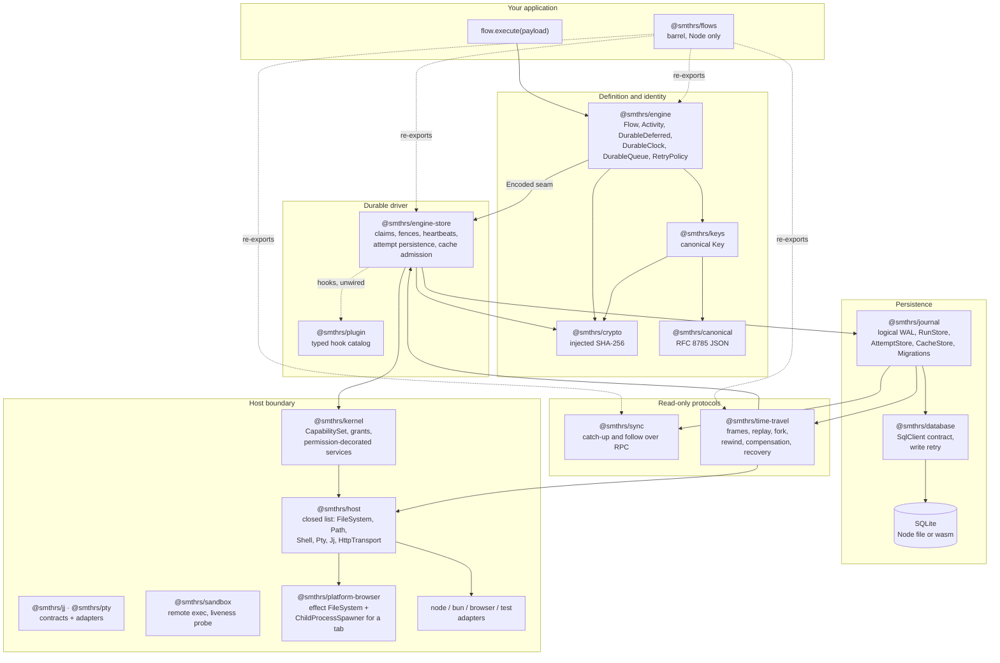
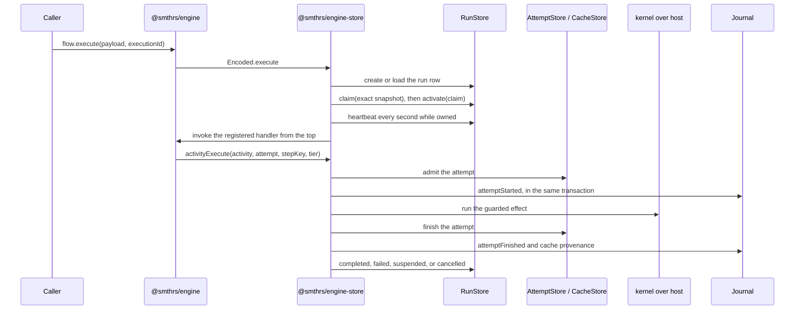

# Architecture

Smithers Flows is one durable-execution engine assembled from sixteen packages. This page shows how they fit together, which direction data moves, and where the boundaries you can substitute are. Read it before anything else; the pages after it assume the picture below.

## The whole system

Solid arrows are workspace dependencies that execute. Dotted arrows are re-exports and the plugin seam, which is defined but not yet dispatched from the engine.

## What each boundary is for

Ask what would break if a boundary were removed, and its purpose becomes clear.

The **host boundary** exists so flow code can run in a browser. `@smthrs/host` declares a closed set of service tags and nothing else; every platform implementation lives under a `/node`, `/bun`, `/browser`, or `/test` subpath. Two of those tags — `Pty` and `Jj` — are contracts of `@smthrs/pty` and `@smthrs/jj`, which host depends on rather than re-exports, so a consumer that needs one capability does not take all six. A module that depends only on the root never statically resolves a `node:` built-in, which is what makes browser bundling possible at all. The browser bundle's own `FileSystem` and `ChildProcessSpawner` are not host contracts at all — they implement `effect`'s, so they live in `@smthrs/platform-browser` over an injected virtual filesystem and in-page bash interpreter. `@smthrs/kernel` sits in front of that surface and decorates each service with a grant check, so a flow that asks for a file it was never granted fails in the error channel rather than reading the file.

The **database and journal** split separates the storage driver from the shapes stored in it. `@smthrs/database` owns no domain tables; it wraps any Effect `SqlClient` and adds the transactional write retry that the rest of the system assumes. `@smthrs/journal` owns the tables and the authoritative schema that creates them. Swap the driver and every shape survives.

The **canonical, crypto, keys, and engine** chain decides identity before storage sees anything. `@smthrs/canonical` owns RFC 8785 JSON, `@smthrs/crypto` owns injected hashing, `@smthrs/keys` owns the canonical workflow-key transformation, and `@smthrs/engine` owns activity-key policy. The engine computes a key before it calls `FlowEngine.Encoded.activityExecute`, so storage never implements key policy.

The **engine and engine-store** pair separates what durability means from where it is written. `@smthrs/engine` defines flows, activities, durable deferreds, durable clocks, durable queues, and retry policy as typed values with an encoded seam beneath them. `@smthrs/engine-store` implements that seam over the journal: it claims a run row before driving it, fences continuing work with a heartbeat, admits and finishes attempt rows, and commits each lifecycle entry in the same transaction as the state transition it describes.

The **plugin** package is the extension seam. Its hook catalog is typed and its kernel resolves, orders, and dispatches plugins today. The engine call sites that would dispatch those hooks still use their built-in defaults, so a plugin cannot yet change engine behavior. Planned.

The **read-only protocols** consume the journal without acquiring ownership. `@smthrs/sync` streams committed entries to a follower over Effect RPC and can neither mutate a run nor resume one. `@smthrs/time-travel` reads frames out of the same history and adds its own tables for snapshots, lineage edges, audits, receipts, and archived entries.

The **barrel**, `@smthrs/flows`, re-exports the sixteen packages as namespaces for a single-import Node application. It re-exports `@smthrs/engine-store`, which reads `process.pid` and `node:crypto`, so the barrel is a Node entry point. A browser application imports the per-package roots.

## One execution, end to end

Six things happen in that sequence, and each one is a decision you can inspect.

**Definition and registration.** `Flow.make` produces a typed value carrying payload, success, and error schemas plus a stable tag. `flow.toLayer(handler)` registers the handler in the active `FlowEngine` scope. Registration is in memory even when the state is durable, so a restarted process must re-register its flows before it can drive stored runs.

**Execution identity.** The caller supplies `executionId`, or the flow derives one from an opt-in `idempotencyKey`. The driver persists the encoded payload under that identity, and a second request with the same identity must present the same flow tag and the same encoded payload.

**Claim and heartbeat.** The driver reads an exact `RunSnapshot`, performs a compare-and-swap claim against it, activates the claim, and only then moves the row to `running`. A heartbeat fiber refreshes the fence every second. Losing the fence interrupts the driving fiber, so two processes cannot persist terminal state for one run.

**Replay and the frontier.** A resume invokes the handler from the top. At each recorded boundary the driver returns the stored result. The first boundary with no recorded state is the frontier, and that is where new work happens. Code between boundaries runs again, so it has to be deterministic.

**Suspension.** `DurableDeferred.await` and long `DurableClock.sleep` calls return `Flow.Suspended` when no result exists. The driver parks the run with a reason, clears ownership, and waits for a wake. Wake-up today is polling and sweeps; an event-driven `resumeSignal` is Planned.

**Terminal state.** A handler that returns stores its encoded `Flow.Result` and moves the row to `completed` or `failed`; interruption moves an owned run to `cancelled`. Every terminal transition clears ownership.

## What is authoritative

Executable state lives in `RunStore`, `AttemptStore`, `CacheStore`, and `DurableEngineState`. The journal is the account of what happened. Those two are kept consistent by one rule: every lifecycle entry commits in the same write transaction as the state transition it describes, opened by `Journal.transact`. Either both halves are durable or neither is.

That rule is local. No database transaction makes an external effect atomic with it, so an effect outside the database still needs an idempotency key, a fencing token, or a declared compensation.

The journal has a second channel. `emitLossy` accepts telemetry into a bounded queue whose `Dropped` receipts and evictions are accepted outcomes, and `flush` is its only barrier. Nothing is ever reconstructed from that channel.

## Reading next

[Data structures](/data-structures) names every shape the arrows above carry. [Package structure](/package-structure) gives the workspace layout, the dependency graph as a table, and the browser and Node entry matrix. [Internal details](/internals) documents the rules the durable driver enforces and the tests that pin them.
