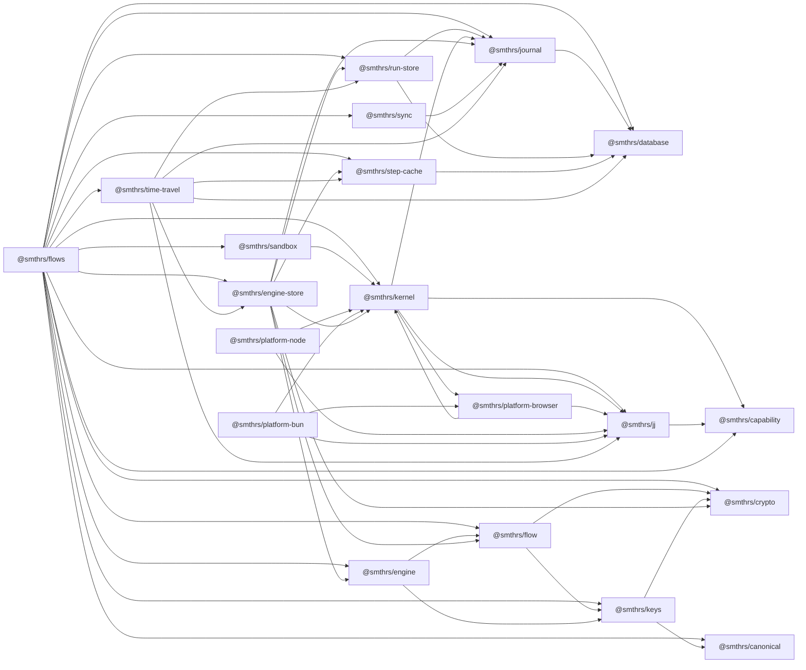

# Package structure

Twenty npm workspaces under `packages/`, one closed dependency set. This page is the map: who owns which data, which package may import which, and which entry points bundle for a browser.

## Workspaces

| Workspace | Directory | Published | Owns |
| --- | --- | --- | --- |
| `@smthrs/flows` | `packages/flows` | yes | nothing; re-exports the engine packages below as namespaces — but not the `platform-*` bundles |
| `@smthrs/jj` | `packages/jj` | yes | no tables; the `Jj` contract, `JjError`, and its adapters |
| `@smthrs/sandbox` | `packages/sandbox` | yes | no tables; remote-sandbox execution and the health probe |
| `@smthrs/platform-browser` | `packages/platform-browser` | yes | no tables; browser `FileSystem` and `ChildProcessSpawner` implementations, and the `BrowserHost` bundle |
| `@smthrs/platform-node` | `packages/platform-node` | yes | no tables; the Node `HttpTransport` and the `NodeHost` bundle |
| `@smthrs/platform-bun` | `packages/platform-bun` | yes | no tables; the Bun filesystem and `HttpTransport`, and the `BunHost` bundle |
| `@smthrs/journal` | `packages/journal` | yes | `flows_journal_events` |
| `@smthrs/run-store` | `packages/run-store` | yes | `flows_runs`, `flows_attempts` |
| `@smthrs/step-cache` | `packages/step-cache` | yes | `flows_step_cache` |
| `@smthrs/database` | `packages/database` | yes | no tables; the `SqlClient` contract and write retry |
| `@smthrs/capability` | `packages/capability` | yes | no tables; the capability vocabulary and typed permission failures, with their journaled schema ids |
| `@smthrs/kernel` | `packages/kernel` | yes | the closed host service list, the `HttpTransport` contract, capability sets, grants, and their journal records |
| `@smthrs/canonical` | `packages/canonical` | yes | no tables; RFC 8785 canonical JSON |
| `@smthrs/crypto` | `packages/crypto` | yes | no tables; injected cryptographic operations |
| `@smthrs/keys` | `packages/keys` | yes | no tables; canonical flow keys |
| `@smthrs/flow` | `packages/flow` | yes | no tables; flow, activity, and durable-primitive definitions plus the runtime port |
| `@smthrs/engine` | `packages/engine` | yes | no tables; the engine that executes them, and the RPC/HTTP façades |
| `@smthrs/engine-store` | `packages/engine-store` | yes | `flows_deferred_completions`, `flows_clock_deadlines`, `flows_run_parents` |
| `@smthrs/sync` | `packages/sync` | yes | no tables; a wire protocol over journal entries |
| `@smthrs/time-travel` | `packages/time-travel` | yes | `flows_time_travel_snapshots`, `_edges`, `_audits`, `_receipts`, `_archive` |
| `@smthrs/examples` | `examples` | no | the runnable example suite |

Every published manifest is `0.1.0`, every internal production range is an exact `0.1.0`, and `effect` is pinned to exact `4.0.0-beta.102`.

## Who owns which data

Five packages create schema, in three different ways. Knowing which is which keeps a table in its owning package.

| Owner | Mechanism | Tables |
| --- | --- | --- |
| `@smthrs/journal` | `0001_initial`, run by `Migrations.layer` | `flows_journal_events` |
| `@smthrs/run-store` | `0001_initial`, run by `Migrations.layer` | `flows_runs`, `flows_attempts` |
| `@smthrs/step-cache` | `0001_initial`, run by `Migrations.layer` | `flows_step_cache` |
| `@smthrs/engine-store` | `0001_initial`; its `Migrations.layer` composes every set above | `flows_deferred_completions`, `flows_clock_deadlines` |
| `@smthrs/engine-store` | statements issued by `DurableEngineState.make` at construction | `flows_run_parents`, its index, the `flows_run_parents_gc` trigger, the stale-running partial index |
| `@smthrs/time-travel` | `SqlTimeTravelStore.migrate` | snapshots, lineage edges, audits, receipts, archive |

Each storage package exports its migration set from its own `Migrations` module, and `@smthrs/database`'s `Migrations` composes them over one `flows_migrations` table: a set declares a `namespace` that prefixes its migration names and an `idOffset` that reserves a block of migration ids, so two packages' `0001_initial` land on distinct identities and a mis-declared package fails the migration instead of silently shadowing a table. `@smthrs/engine-store/Migrations` is the composed list an engine installs.

The engine-store statements sit outside its migration deliberately, because the package creates them when its layer is built. They are inventoried in `packages/engine-store/src/internal/EngineStateSchema.ts` with the dialects each one is known to accept, and a catalog-diff test fails when new DDL appears without an inventory entry.

## Dependency graph

An arrow means the left package imports the right one.

| Package | Depends on | Depended on by |
| --- | --- | --- |
| `@smthrs/canonical` | nothing in the workspace | `keys`, `flows` |
| `@smthrs/crypto` | nothing in the workspace | `keys`, `flow`, `engine-store`, `flows` |
| `@smthrs/keys` | `canonical`, `crypto` | `flow`, `engine`, `flows` |
| `@smthrs/capability` | nothing in the workspace | `jj`, `kernel`, `flows` |
| `@smthrs/jj` | `capability` | `kernel`, `platform-*`, `time-travel`, `flows` |
| `@smthrs/platform-browser` | `jj`, `kernel` | `kernel` (test bundle only), `platform-bun` |
| `@smthrs/platform-node` | `jj`, `kernel` | nothing |
| `@smthrs/platform-bun` | `jj`, `kernel`, `platform-browser` | nothing |
| `@smthrs/sandbox` | `kernel` | `flows` |
| `@smthrs/database` | nothing in the workspace | `journal`, `run-store`, `step-cache`, `time-travel`, `flows` |
| `@smthrs/journal` | `database` | `kernel`, `run-store`, `engine-store`, `sync`, `time-travel`, `flows` |
| `@smthrs/run-store` | `database`, `journal` | `engine-store`, `time-travel`, `flows` |
| `@smthrs/step-cache` | `database` | `engine-store`, `time-travel`, `flows` |
| `@smthrs/kernel` | `capability`, `jj`, `journal`, `platform-browser` | `engine-store`, `platform-*`, `sandbox`, `time-travel`, `flows` |
| `@smthrs/flow` | `crypto`, `keys` | `engine`, `engine-store`, `flows` |
| `@smthrs/engine` | `flow`, `keys` | `engine-store`, `flows` |
| `@smthrs/engine-store` | `crypto`, `flow`, `engine`, `journal`, `run-store`, `step-cache`, `kernel` | `time-travel`, `flows` |
| `@smthrs/sync` | `journal` | `flows` |
| `@smthrs/time-travel` | `database`, `engine-store`, `jj`, `journal`, `run-store`, `step-cache` | `flows` |
| `@smthrs/flows` | every package except the three `platform-*` bundles | nothing |

`npm run circular` fails the build on an import cycle, within a package or across them.

The one cycle at *package* granularity is `kernel` ↔ `platform-browser`: the kernel's deterministic `TestHost` bundle (a test-only subpath) mounts the browser filesystem and interpreter, and `BrowserHost` provides the kernel's `HttpTransport` slot. No module-level cycle exists, which is what `npm run circular` checks. The parked `remove-http-transport` lane removes the second half of it.

## Entry point matrix

A package root exports contracts. A platform implementation lives under a subpath named for its platform, the way `effect` keeps `@effect/platform-node` out of `effect`. A root that re-exports an implementation resolves that implementation's imports for every consumer, including browser ones, before any bundler can tree-shake it.

`scripts/browser-check.mjs` executes this table. It bundles each browser entry point with esbuild `platform: "browser"` and fails if one breaks, and it bundles each Node entry point and fails if one stops failing. `npm run browser` runs it locally and CI runs it as a step.

| Entry point | Browser | Node | Why |
| --- | --- | --- | --- |
| `@smthrs/platform-browser` | yes | yes | browser `FileSystem` and `ChildProcessSpawner`, the fetch transport, and the `BrowserHost` bundle |
| `@smthrs/platform-browser/BrowserHost` | yes | yes | `layer({ bash, fs })` over an injected browser filesystem and interpreter; Jujutsu reports unsupported |
| `@smthrs/platform-node` | no | yes | child processes, Node filesystem, Jujutsu |
| `@smthrs/platform-bun` | no | yes | the Bun adapters, falling back to `@effect/platform-node` off Bun |
| `@smthrs/kernel/test/TestHost` | no | yes | `effect/testing`'s `TestClock` imports `node:assert` |
| `@smthrs/jj` | yes | yes | the `Jj` contract, `JjError`, and the no-op layer |
| `@smthrs/jj/browser/BrowserJj` | yes | yes | every operation reports `not_installed` |
| `@smthrs/jj/node/NodeJj`, `@smthrs/jj/bun/BunJj` | no | yes | spawn the jj CLI through `node:child_process` |
| `@smthrs/sandbox` | yes | yes | provider adaptation and the liveness probe; no host access of its own |
| `@smthrs/capability` | yes | yes | capability vocabulary and typed permission failures |
| `@smthrs/kernel` | yes | yes | capabilities, grants, decorated services |
| `@smthrs/canonical` | yes | yes | RFC 8785 canonical JSON schema |
| `@smthrs/crypto` | yes | yes | injected cryptographic schemas |
| `@smthrs/keys` | yes | yes | canonical flow-key schema |
| `@smthrs/database` | yes | yes | the driver-neutral contract only |
| `@smthrs/database/node/NodeDatabase` | no | yes | `node:sqlite` through `@effect/sql-sqlite-node` |
| `@smthrs/database/test/TestDatabase` | no | yes | in-memory SQLite through the same driver |
| `@smthrs/journal` | yes | yes | the journal and its migration over `SqlClient` and the `DurableWriter` contract |
| `@smthrs/journal/test/TestJournal` | no | yes | composes `TestDatabase` |
| `@smthrs/run-store` | yes | yes | run and attempt stores over the same contracts |
| `@smthrs/run-store/test/TestRunStore` | no | yes | composes `TestDatabase` |
| `@smthrs/step-cache` | yes | yes | the step cache over the same contracts |
| `@smthrs/step-cache/test/TestCacheStore` | no | yes | composes `TestDatabase` |
| `@smthrs/flow` | yes | yes | flow, activity, durable primitives, retry, identity |
| `@smthrs/engine` | yes | yes | the engine that executes flows, plus the RPC/HTTP façades |
| `@smthrs/engine-store` | yes | yes | the durable engine; owner identity enters through `OwnerIdentity` |
| `@smthrs/sync` | yes | yes | protocol and client and server over RPC |
| `@smthrs/time-travel` | yes | yes | frames, replay, fork, rewind, compensation, recovery |
| `@smthrs/flows` | yes | yes | re-exports every engine package |

Twenty entry points bundle for the browser. Bundling is a weaker claim than running: `@smthrs/journal`, `@smthrs/run-store`, and `@smthrs/step-cache` bundle because they depend on the `DurableWriter` contract, and a browser application still has to supply a browser SQL client, such as Effect's sqlite-wasm OPFS worker, to that contract. No such layer ships here.

The accurate sentence is that canonical JSON, crypto, the host contracts, `BrowserHost`, keys, capability, kernel, database, journal, run store, step cache, flow, engine, engine-store, the barrel, sync, and time travel bundle for the browser, and the durable engine composition is still SQLite-on-Node first because no browser SQL client layer ships here. `@smthrs/engine-store`'s last two `node:`-flavoured reads — `process.pid` and `node:crypto` `randomUUID` — moved behind the `OwnerIdentity` service, which closed issue #114.

## Build shape

Every published package builds a dual module surface: `dist/esm/index.js`, `dist/esm/index.d.ts`, and `dist/cjs/index.js`, named by a conditional `publishConfig.exports` map with `./internal/*` blocked. Every package ships a byte-identical `LICENSE` in its `files` whitelist. `packages/flow` and `packages/engine` additionally ship `THIRD_PARTY_NOTICES.md`, because they carry the two halves of a fork of Effect's unstable workflow surface; `packages/engine` also ships the `VENDOR.md` that records the fork for both.

New package modules mirror the Effect repository: file structure, module layout, `make` and `layer` naming, error conventions, and `@since` and `@category` JSDoc.

## Reading next

[Public API](/api/flows) enumerates the exports of each package. [Internal details](/internals) covers the invariants the engine-store owns. [External](/external) states what a deployment cannot do yet.
