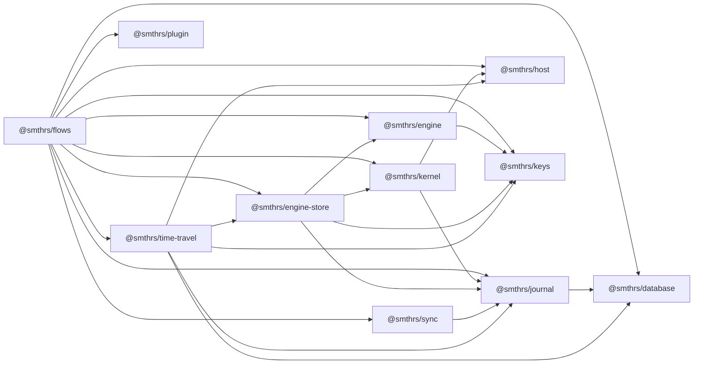

# Package structure

Eleven npm workspaces under `packages/`, one closed dependency set, no runtime dependency outside `effect` and the SQL client packages. This page is the map: who owns which data, which package may import which, and which entry points bundle for a browser.

## Workspaces

| Workspace | Directory | Published | Owns |
| --- | --- | --- | --- |
| `@smthrs/flows` | `packages/flows` | yes | nothing; re-exports the ten below as namespaces |
| `@smthrs/host` | `packages/host` | yes | the closed host service contracts and their adapters |
| `@smthrs/journal` | `packages/journal` | yes | `flows_journal_events`, `flows_runs`, `flows_attempts`, `flows_step_cache`, the migration ladder |
| `@smthrs/database` | `packages/database` | yes | no tables; the `SqlClient` contract and write retry |
| `@smthrs/kernel` | `packages/kernel` | yes | capability sets, grants, and their journal records |
| `@smthrs/keys` | `packages/keys` | yes | no tables; canonical serialization and step keys |
| `@smthrs/engine` | `packages/engine` | yes | no tables; flow, activity, and durable-primitive definitions |
| `@smthrs/engine-store` | `packages/engine-store` | yes | `flows_deferred_completions`, `flows_clock_deadlines`, `flows_run_parents` |
| `@smthrs/plugin` | `packages/plugin` | yes | no tables; the hook catalog and kernel |
| `@smthrs/sync` | `packages/sync` | yes | no tables; a wire protocol over journal entries |
| `@smthrs/time-travel` | `packages/time-travel` | yes | `flows_time_travel_snapshots`, `_edges`, `_audits`, `_receipts`, `_archive` |
| `@smthrs/examples` | `examples` | no | the runnable example suite |

Every published manifest is `0.1.0`, every internal production range is an exact `0.1.0`, and `effect` is pinned to exact `4.0.0-beta.102`.

## Who owns which data

Three packages create schema, and they create it in three different ways. Knowing which is which is what keeps a migration from landing in the wrong ladder.

| Owner | Mechanism | Tables |
| --- | --- | --- |
| `@smthrs/journal` | the numbered ladder in `src/migrations/`, run by `Migrations.layer` | events, runs, attempts, cache, plus the `0002` deferred and clock tables and the `0003` and `0004` run-row columns |
| `@smthrs/engine-store` | statements issued by `DurableEngineState.make` at construction | `flows_run_parents`, its index, the `flows_run_parents_gc` trigger, the stale-running partial index |
| `@smthrs/time-travel` | `SqlTimeTravelStore.migrate` | snapshots, lineage edges, audits, receipts, archive |

The engine-store statements sit outside the ladder deliberately, because the package creates them when its layer is built rather than as part of a versioned upgrade. They are inventoried in `packages/engine-store/src/internal/EngineStateSchema.ts` with the dialects each one is known to accept, and a catalog-diff test fails when new out-of-ladder DDL appears without an inventory entry.

## Dependency graph

An arrow means the left package imports the right one.

| Package | Depends on | Depended on by |
| --- | --- | --- |
| `@smthrs/keys` | nothing in the workspace | `engine`, `engine-store`, `time-travel`, `flows` |
| `@smthrs/host` | nothing in the workspace | `kernel`, `time-travel`, `flows` |
| `@smthrs/database` | nothing in the workspace | `journal`, `time-travel`, `flows` |
| `@smthrs/plugin` | nothing in the workspace | `flows` |
| `@smthrs/journal` | `database` | `kernel`, `engine-store`, `sync`, `time-travel`, `flows` |
| `@smthrs/kernel` | `host`, `journal` | `engine-store`, `time-travel`, `flows` |
| `@smthrs/engine` | `keys` | `engine-store`, `flows` |
| `@smthrs/engine-store` | `engine`, `keys`, `journal`, `kernel` | `time-travel`, `flows` |
| `@smthrs/sync` | `journal` | `flows` |
| `@smthrs/time-travel` | `database`, `engine-store`, `host`, `journal`, `keys` | `flows` |
| `@smthrs/flows` | all ten | nothing |

`npm run circular` fails the build on an import cycle, within a package or across them.

## Entry point matrix

A package root exports contracts. A platform implementation lives under a subpath named for its platform, the way `effect` keeps `@effect/platform-node` out of `effect`. A root that re-exports an implementation resolves that implementation's imports for every consumer, including browser ones, before any bundler can tree-shake it.

`scripts/browser-check.mjs` executes this table. It bundles each browser entry point with esbuild `platform: "browser"` and fails if one breaks, and it bundles each Node entry point and fails if one stops failing. `npm run browser` runs it locally and CI runs it as a step.

| Entry point | Browser | Node | Why |
| --- | --- | --- | --- |
| `@smthrs/host` | yes | yes | service tags, `HostError`, `RemoteSandbox`, `SandboxHealth`, no-op layers |
| `@smthrs/host/browser/BrowserHost` | yes | yes | `layer({ bash, fs })` over an injected browser filesystem; PTY and Jujutsu report unsupported |
| `@smthrs/host/node/NodeHost` | no | yes | child processes, Node filesystem, PTY, Jujutsu |
| `@smthrs/host/bun/BunHost` | no | yes | the Bun adapters, falling back to `@effect/platform-node` off Bun |
| `@smthrs/host/test/TestHost` | no | yes | `effect/testing`'s `TestClock` imports `node:assert` |
| `@smthrs/kernel` | yes | yes | capabilities, grants, decorated services |
| `@smthrs/keys` | yes | yes | pure serialization and digests |
| `@smthrs/database` | yes | yes | the driver-neutral contract only |
| `@smthrs/database/node/NodeDatabase` | no | yes | `node:sqlite` through `@effect/sql-sqlite-node` |
| `@smthrs/database/test/TestDatabase` | no | yes | in-memory SQLite through the same driver |
| `@smthrs/journal` | yes | yes | stores and migrations over the `Database` contract |
| `@smthrs/journal/test/TestJournal` | no | yes | composes `TestDatabase` |
| `@smthrs/engine` | yes | yes | flow, activity, durable primitives, retry, identity |
| `@smthrs/engine-store` | no | yes | reads `process.pid` and imports `randomUUID` from `node:crypto` |
| `@smthrs/plugin` | yes | yes | hooks, resolution, config pipeline |
| `@smthrs/sync` | yes | yes | protocol and client and server over RPC |
| `@smthrs/time-travel` | yes | yes | frames, replay, fork, rewind, compensation, recovery |
| `@smthrs/flows` | no | yes | re-exports `@smthrs/engine-store` |

Ten entry points bundle for the browser. Bundling is a weaker claim than running: `@smthrs/journal` bundles because it depends on the `Database` contract, and a browser application still has to supply a browser SQL client, such as Effect's sqlite-wasm OPFS worker, to that contract. No such layer ships here.

The accurate sentence is that the host contracts, `BrowserHost`, keys, kernel, database, journal, engine, plugin, sync, and time travel bundle for the browser, and the durable engine composition is Node and SQLite first. `@smthrs/engine-store`'s two `node:` uses are the complete browser-gap inventory, tracked as issue #114.

## Build shape

Every published package builds a dual module surface: `dist/esm/index.js`, `dist/esm/index.d.ts`, and `dist/cjs/index.js`, named by a conditional `publishConfig.exports` map with `./internal/*` blocked. Every package ships a byte-identical `LICENSE` in its `files` whitelist. `packages/engine` additionally ships `THIRD_PARTY_NOTICES.md` and `VENDOR.md`, because it vendors Effect's unstable workflow surface.

New package modules mirror the Effect repository: file structure, module layout, `make` and `layer` naming, error conventions, and `@since` and `@category` JSDoc.

## Reading next

[Public API](/api/flows) enumerates the exports of each package. [Internal details](/internals) covers the invariants the engine-store owns. [External](/external) states what a deployment cannot do yet.
